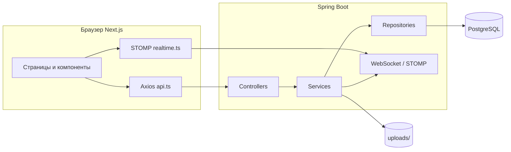

# Документация системы бронирования ресторана

Материал для защиты: как устроены фронтенд, бэкенд, база данных и связи между ними.

---

## 1. Назначение проекта

Веб-приложение для просмотра филиалов и залов, выбора столика по времени, бронирования, личного кабинета пользователя и административной панели (филиалы, залы, столы, меню, заявки). Есть обновление интерфейса в реальном времени через WebSocket (STOMP).

---

## 2. Технологический стек

| Слой               | Технологии                                                                               |
| ------------------ | ---------------------------------------------------------------------------------------- |
| **Фронтенд**       | Next.js 14 (App Router), React, TypeScript, Axios, @stomp/stompjs                        |
| **Бэкенд**         | Java 17, Spring Boot 3.2, Spring Web, Spring Data JPA, Spring Security, Spring WebSocket |
| **БД**             | PostgreSQL                                                                               |
| **Аутентификация** | JWT (Bearer), BCrypt для паролей                                                         |

---

## 3. Как фронтенд подключается к бэкенду

### 3.1. HTTP (REST)

- **Базовый URL** задаётся переменной окружения `NEXT_PUBLIC_API_URL`. Если она не задана, используется `http://localhost:8080`.
- Реализация: файл `frontend/src/lib/api.ts` — создаётся экземпляр **Axios** с `baseURL`, ко всем запросам при необходимости добавляется заголовок `Authorization: Bearer <токен>` из `localStorage` (см. `frontend/src/lib/auth.ts`).
- При ответе **401** токен очищается (перехватчик ответа в `api.ts`).
- Для загрузки изображений меню используется `FormData`; заголовок `Content-Type` для таких запросов снимается, чтобы браузер сам проставил `multipart/form-data` с boundary.

### 3.2. WebSocket (реальное время)

- Файл `frontend/src/lib/realtime.ts`: из того же базового URL строится адрес **`ws://.../ws`** (или `wss://` в продакшене).
- Подключение STOMP с опциональным заголовком `Authorization: Bearer ...` при наличии токена.
- Подписки:
  - **`/topic/halls/{hallId}`** — сигнал обновить доступность столов на схеме зала (публично, endpoint открыт в Security).
  - **`/user/queue/bookings`** — персональные события бронирований (нужен валидный JWT при подключении).
  - **`/topic/admin/bookings`** — все события для администратора (роль ADMIN).

### 3.3. CORS на бэкенде

В `backend/src/main/resources/application.yml` параметр `app.cors.allowed-origins` (по умолчанию `http://localhost:3000`) разрешает запросы с фронтенда. Без этого браузер блокировал бы REST и WebSocket с другого origin.

---

## 4. Как бэкенд подключается к базе данных

### 4.1. Конфигурация

Файл `backend/src/main/resources/application.yml`:

- **`spring.datasource`**: JDBC URL `jdbc:postgresql://localhost:5432/restaurant_db`, пользователь/пароль PostgreSQL, драйвер `org.postgresql.Driver`.
- **`spring.jpa`**: диалект PostgreSQL, **`ddl-auto: validate`** в основном профиле — схема должна соответствовать сущностям Hibernate (таблицы создаются из `database/schema.sql` или вручную).

Профиль **`dev`** (`application-dev.yml`) задаёт **`ddl-auto: create-drop`** — при каждом запуске схема пересоздаётся (удобно для разработки; в защите уточните: в продакшене обычно `validate` + миграции/SQL).

### 4.2. Доступ к данным

- **Spring Data JPA**: интерфейсы репозиториев в пакете `...repository` наследуют `JpaRepository` и при необходимости объявляют методы запросов.
- **Сущности** (`entity`): классы с аннотациями `@Entity`, `@Table`, связи `@ManyToOne` и т.д. мапятся на таблицы PostgreSQL.
- Транзакции: на сервисах используется `@Transactional` (чтение/запись).

Итоговая цепочка: **контроллер → сервис → репозиторий → JPA/Hibernate → JDBC → PostgreSQL**.

---

## 5. Схема базы данных

Источник правды по структуре таблиц: `database/schema.sql`.

| Таблица           | Назначение                                                                  |
| ----------------- | --------------------------------------------------------------------------- |
| **branches**      | Филиалы ресторана                                                           |
| **halls**         | Залы внутри филиала (`branch_id` → `branches`)                              |
| **users**         | Пользователи, роль (`USER` / `ADMIN`), хеш пароля                           |
| **dining_tables** | Столики в зале: номер, вместимость, статус, координаты на плане, форма      |
| **reservations**  | Брони: пользователь, стол, время, длительность, число гостей, статус        |
| **menu_items**    | Позиции меню: название, описание, цена, категория, путь к файлу изображения |

Связи: филиал → залы → столы; пользователь → брони → стол; индексы на частые выборки (зал, стол+время, доступное меню).

Файлы загрузок меню хранятся на диске в каталоге `uploads` (см. `app.upload.directory` в `application.yml`), а в БД сохраняется относительный путь/URL для отдачи через API.

---

## 6. Архитектура бэкенда (пакеты и роли классов)

Корневой пакет: `com.restaurant.reservation`.

| Пакет / слой     | Роль                                                                     |
| ---------------- | ------------------------------------------------------------------------ |
| **`controller`** | REST API: маршруты, приём JSON/multipart, вызов сервисов, HTTP-коды      |
| **`service`**    | Бизнес-логика, транзакции, вызов репозиториев и `RealtimeEventPublisher` |
| **`repository`** | Доступ к БД через Spring Data JPA                                        |
| **`entity`**     | Модель данных, соответствие таблицам                                     |
| **`dto`**        | Объекты передачи данных (запрос/ответ API), отделены от сущностей        |
| **`config`**     | Security, WebSocket, настройки JWT и загрузки файлов                     |
| **`security`**   | JWT, фильтр аутентификации, UserDetails, интерцептор STOMP               |
| **`exception`**  | Исключения и `GlobalExceptionHandler` — единый формат ошибок для фронта  |

### 6.1. Основные REST-контроллеры

- **`AuthController`** (`/api/auth`) — регистрация и вход, выдача JWT.
- **`BranchController`** (`/api/v1/branches`) — список филиалов и залов филиала (публично GET).
- **`TableController`** (`/api/v1/tables`) — план зала с учётом занятости на выбранное время; `/available` — только свободные столы.
- **`ReservationController`** (`/api/v1/reservations`, `/api/v1/users/me/bookings`) — создание брони и список своих броней (нужна аутентификация).
- **`MenuController`** (`/api/v1/menu`) — публичное меню.
- **`AdminController`** (`/api/v1/admin/**`) — CRUD филиалов, залов, столов, меню, список всех броней, смена статуса брони (только **роль ADMIN**).
- **`UploadedFileController`** (`/api/v1/files/menu/{fileName}`) — отдача файлов изображений из безопасного пути.

### 6.2. Пример бизнес-логики бронирования

`ReservationService.createReservation`:

1. Загружает пользователя и стол из БД.
2. Проверяет, что стол в статусе, допускающем бронь, и число гостей ≤ вместимости.
3. Проверяет, что время в будущем и нет пересечения с другими активными бронями на этот стол.
4. Сохраняет запись и через **`RealtimeEventPublisher`** рассылает события по WebSocket (зал, админка, личная очередь пользователя).

---

## 7. Безопасность

- **`SecurityConfig`**: отключён CSRF для stateless API; сессии не используются; перед `UsernamePasswordAuthenticationFilter` вставлен **`JwtAuthenticationFilter`**.
- Правила доступа (упрощённо): публично — auth, GET филиалы/залы, GET столы и меню, GET файлов, endpoint `/ws`; префикс **`/api/v1/admin/**`** — только `ROLE_ADMIN`; остальное — аутентифицированный пользователь.
- Пароли: **`BCryptPasswordEncoder`** при регистрации в `AuthService`.
- JWT: генерация и проверка в **`JwtService`**, секрет и TTL в `application.yml` / `JWT_SECRET`.

---

## 8. Компонент `MenuGrid.tsx` (фронтенд)

Файл: `frontend/src/components/MenuGrid.tsx`.

**Назначение:** отображение меню ресторана для посетителя сеткой по категориям.

**Как работает:**

1. При монтировании (`useEffect`) вызывается **`fetchMenu()`** из `lib/api.ts` → HTTP **GET `/api/v1/menu`** на бэкенд → `MenuController` → `MenuItemService.findPublicMenu()`.
2. Пока данные грузятся — показывается индикатор загрузки.
3. При ошибке — сообщение (в т.ч. русификация через **`getErrorMessage`**).
4. Если список пуст — текст «Меню скоро появится».
5. Иначе категории собираются из уникальных значений `category`, для каждой категории рендерится секция с карточками.
6. Для картинки используется **`menuImageUrl(item.imageUrl)`**: превращает относительные пути вида `/uploads/...` в полный URL через **`/api/v1/files/...`** и `NEXT_PUBLIC_API_URL`.

Итого: компонент **только отображает данные**; вся логика и БД — на бэкенде.

---

## 9. Запуск для демонстрации (кратко)

1. PostgreSQL: создать БД по `database/schema.sql` (или профиль `dev` с `create-drop`).
2. Backend: `cd backend && mvn spring-boot:run` (порт **8080**).
3. Frontend: `cd frontend`, при необходимости `.env.local` с `NEXT_PUBLIC_API_URL=http://localhost:8080`, затем `npm run dev` (порт **3000**).

Подробности и демо-аккаунты — в корневом **`README.md`**.

---

## 10. Диаграмма потоков (логическая)

---

_Документ отражает состояние кода на момент создания. При изменении API или схемы БД обновляйте этот файл вместе с `README.md`._
